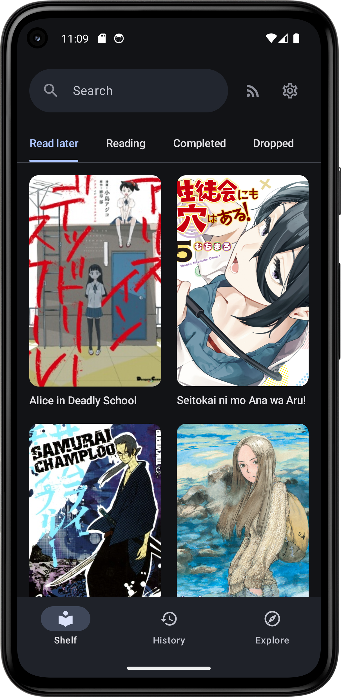
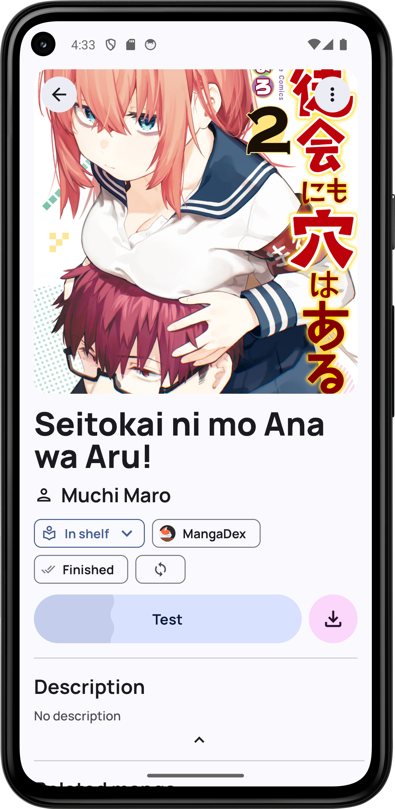
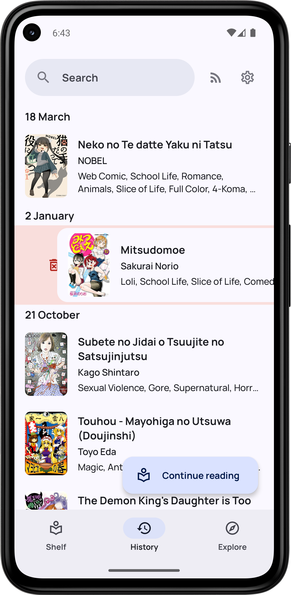
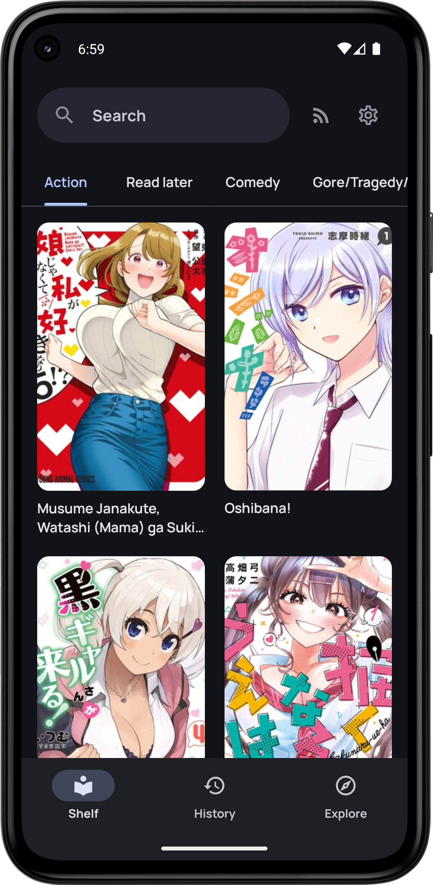
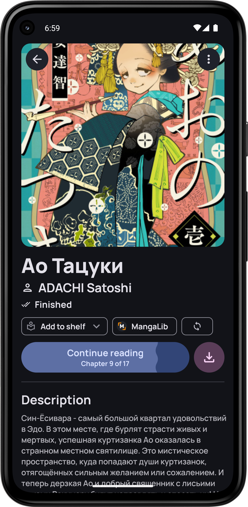
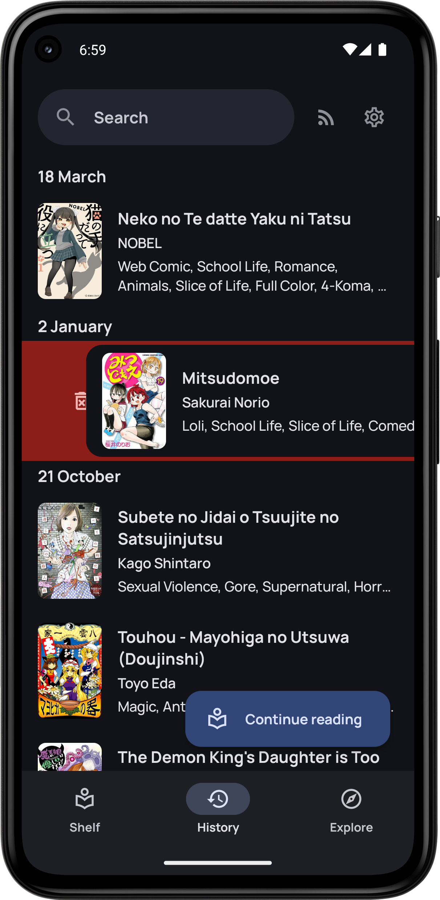

# Etsudoku

Etsudoku (閲読) - An attempt to write an Android manga reading application on Jetpack Compose using the [Kotatsu parser library](https://github.com/KotatsuApp/kotatsu-parsers).

## Is it possible to use it now?

No, nothing works.

## Screens
|                    Shelf                     |                     Details                      |                     History                      |
|:--------------------------------------------:|:------------------------------------------------:|:------------------------------------------------:|
|      |      |      |
|  |  |  |

## Acknowledgements

- [Kotatsu](https://github.com/KotatsuApp/Kotatsu) - UI, parsers, under the hood
- [Seal](https://github.com/JunkFood02/Seal) - UI
- [MoeList](https://github.com/axiel7/MoeList) - Under the hood

## License

You may copy, distribute and modify the software as long as you track changes/dates in source files.
Any modifications to or software including (via compiler) GPL-licensed code must also be made available under the
GPL along with build & install instructions.
 
