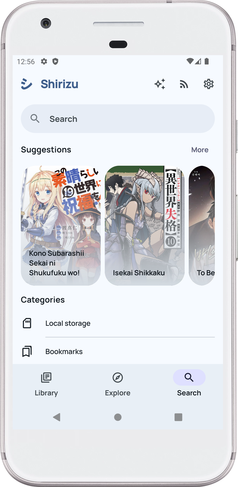

# Shirizu

Shirizu (シリーズ, from Japanese - series) - An attempt to write an Android manga reading application on Jetpack Compose using the [Kotatsu parser library](https://github.com/KotatsuApp/kotatsu-parsers).

## Is it possible to use it now?

No, nothing works.

## Screens
|                  Library                   |                   Explore                    |                   Search                    |
|:------------------------------------------:|:--------------------------------------------:|:-------------------------------------------:|
|  |  |  |

## Acknowledgements

- [Kotatsu](https://github.com/KotatsuApp/Kotatsu) - UI, parsers, under the hood
- [Mihon](https://github.com/mihonapp/mihon) - UI, under the hood
- [Seal](https://github.com/JunkFood02/Seal) - UI
- [Tivi](https://github.com/chrisbanes/tivi) - UI
- [Buckwheat](https://github.com/danilkinkin/buckwheat) - UI

## License

You may copy, distribute and modify the software as long as you track changes/dates in source files.
Any modifications to or software including (via compiler) GPL-licensed code must also be made available under the
GPL along with build & install instructions.
 
